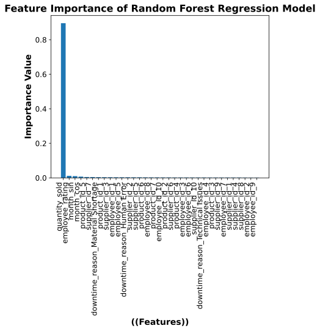

# Production Quantity Prediction for Lai Manufacturing Plc: Leveraging Machine Learning Model to Optimize Production Quantity

### Introduction
This project focuses on building machine learning model that predicts production quantity from Lai Manufacturing Plc, a Tree based Model (Random Forest) and a Linear model (Bayesian) were chosen as baseline models, evaluation and comparison were done to the tuned models to get the best performing model.  

**Goal:** To derive the optimal predictive model between a Tree based and Linear based machine learning model for Lai Manufacturing Plc. 

**Objectives:**
* Use simple Random Forest Regression and Bayesian Ridge Regression models as baseline models;
* Carry out hyperparameter tuning on models and evaluate using the MAE,RMSE, and R2 score;
* Derived the most significant features from the optimal model.  

**Research Questions:**
* Which is the best performing predictive model between Random Forest regression and Bayes Ridge regression after tuning for Lai manufacturing plc.
* What are the most significant features needed to predict production quantity for Lai Manufacturing Plc. 

**Key Models:** 
* Random Forest Regressor and Bayesian Ridge Regression (tuned using Grid Search and AdaBoost regressor as Ensemble method).

**Target Variable:** 
* Production quantity from production operations in the year 2023.

#### Setup and Installation
Prerequisites 
•	Python 3.8+ 
•	pip package installer
#### Environment Setup
1.	Clone the repository:
2.	git clone [https://github.com/Eddclectic/Production-Quantity-Prediction.git](https://github.com/Eddclectic/Production-Quantity-Prediction.git)
3.	cd Production_quantity_prediction
4.	Create and activate a virtual environment:
5.	python -m venv venv
6.	source venv/bin/activate  # On Linux/macOS
7.	.\venv\Scripts\activate   # On Windows
8.	Install dependencies:
9.	install all the relevant libraries

#### Data
Data Source
The data is sourced from Lai Manufacturing Plc, it entails production operations information in the year 2023 [data credit: https://www.amdari.io/dashboard-projects/dashboard-project-paths/details/125](https://github.com/Eddclectic/Production-Quantity-Prediction.git).

#### Data Description
Dataset of 1000 rows will be extracted from Lai manufacturing Plc database. This dataset will be analyzed to understand the pain point of the business. The attributes include: 

✓ Operations_ID:  A unique identifier for each operation or record in the dataset. 
✓ Product_ID: A unique identifier for each product in the dataset. It associates each operation with a specific product. 
✓ Product_Name: The name of the product associated with the operation. 
✓ Product_Category: The category to which the product belongs (e.g., Home Appliances or Industrial Machinery). 
✓ Production_Date: The date on which the operation or production occurred. 
✓ Production_Quantity: The quantity of the product produced during the operation. 
✓ Quality_Metrics: A measurement or assessment of the quality of the product produced during the operation. It may indicate whether the product "Passed," "Failed," or falls "In Between" quality standards. 
✓ Quantity_in_Stock: The quantity of the product available in stock after the operation. 
✓ Quantity_Sold: The quantity of the product that has been sold after the operation. 
✓ Supplier_ID: A unique identifier for the supplier associated with the operation. 
✓ Supplier_Name: The name of the supplier that provided materials or components for the production. 
✓ Lead_Time: The time it takes for the supplier to deliver materials or components to support the operation. 
✓ Employee_ID: A unique identifier for the employee involved in the operation. 
✓ Employee_Name: The name of the employee responsible for the operation. 
✓ Shift_Information: The shift during which the operation occurred. It can be "Morning Shift," "Afternoon Shift," "Evening Shift," or "Night Shift." 
✓ Maintenance_Type: The type of maintenance carried out during or after the operation, which can be "Routine Maintenance" or "Repairs." 
✓ Downtime_Duration: The duration of downtime experienced during the operation, indicating the time the operation was not productive. 
✓ Energy_Consumption_Data: Data representing the energy consumed during the operation. 
✓ Production_Time: The time it took to complete the operation or production. 
✓ Downtime_Events: The number of downtime events that occurred during the operation. 
✓ Employee_Rating: The rating or performance assessment of the employee involved in the operation, typically on a scale from 1 to 5. 
✓ Downtime_Reason: The reason for any downtime experienced during the operation. Possible reasons may include "Material Shortage," "Technical Issues," or "Human Error." 

### Feature Engineering Highlights
The features are pre-processed to handle non-linearity and high-cardinality categorical data:
*	One Hot Encoding: Applied to nominal categorical features (supplier_id, employee_id, downtime_reasons, product_id)
*	Label Encoding: Applied to ordinal categorical features (employee_rating)
*	Cyclical Encoding: Applied to time-based features (month and day) to capture periodicity.
*	Scaling: Train and Test datasets are scaled using StandardScaler.
### Feature Selection Highlights
The desired features are carefully reviewed and selected before inclusion in the models.
*	Coefficient Matrix: Using a benchmark of R>0.84 as highly correlated and R<0.1 as lowly correlated, we drop all highly and lowly correlated features.
*	Bivariate Analysis: The bivariate analysis provided insight on features with little influence on target variable. Some of these features are year, product_category, shift_information e.t.c.
*	Domain knowledge: Some features like “quantity_sold” and “quality_metrics” were deselected due to their suspected negative effect on our supposed model or over reliance on the target variable.

### Modeling Strategy
The Random Forest Regression model and the Bayesian Ridge regression model were built using the 80-20% Train/Test split with each models giving an R2 score of approximately 72% each, but the random Forest showed high overfitting while the Bayes Ridge gave no fitting issues.

#### Random Forest Model Result 
* Train Scores 
MAE  38.570524999999996 
RMSE  46.849598520158104 
R2 score  0.9560871268701058 

* Test Scores 
MAE  110.33765 
RMSE  131.00368378980798 
R2 score  0.7173683498294464 

#### Bayesian Ridge Model Result 
* Train Scores 
MAE  97.05860810020687 
RMSE  116.74920371361304 
R2 score  0.7272982278123876 

* Test Scores 
MAE  108.54917911394183
RMSE  128.50813419950242
R2 score  0.728033749201833

Using the R2 score as metric to evaluate both models without parameter tuning, it is seen that the Bayesian Ridge appears to perform better but this is subjected to final confirmation with hyperparameter tuning on both models using gridsearchCV.

### Grid Search (Hyperparameter Tuning)
The models were optimized using gridsearchCV and AdaBoost regressor as the choice ensemble method to find the best configuration. 

**Best Hyperparameters for Bayesian Ridge Regressor:** {'estimator__alpha_1': 0.0001, 'estimator__alpha_2': 1e-06, 'estimator__lambda_1': 1e-06, 'estimator__lambda_2': 1e-05, 'learning_rate': 1.0, 'n_estimators': 50} 
* Train Scores 
MAE  98.19449191053218 
RMSE  117.0734604066172 
R2 score  0.7257813323242226 

* Test Scores 
MAE  107.49048578121761 
RMSE  126.92536293137954 
R2 score  0.7346918411019698 

**Best Hyperparameters RandomForest Regressor:** {'estimator__max_depth': 5, 'estimator__min_samples_split': 2, 'estimator__n_estimators': 50, 'learning_rate': 0.1, 'n_estimators': 50} 
* Train Scores 
MAE  84.50118547878981 
RMSE  99.9827653185333 
R2 score  0.7999998163154538 

* Test Scores
MAE  105.34855922255058 
RMSE  124.60093801684158 
R2 score  0.7443202096111241 

The issue of overfitting was majorly handled in the Random forest model which improved its model performance more than the Bayesian Ridge Regression with about 1% according to the R2 score. It also shows better performance in terms of MAE and RMSE.

### Feature Importance
The model provides insight on the most significant features in production quantity prediction with the Random Forest regression model. This is a vital information for predicting strategy of production quantity.
*	Quantity sold (Highest influence)
*	Employee rating
*	Month_sin
*	Month_cos

### Conclusion
The performance of typical machine learning models on small datasets can be a bit questionable but the right advanced models and proper hyperparameter tuning can greatly improve on these models’ performances. In this project, the Tree based model (Random Forest Regression) appears to perform best after proper hyperparameter tuning in combination with the ensemble method of Adaptive boost method. Most of the features show less relevance to the target variable and only few variables like the quantity sold and employee rating e.t.c showed great influence on the model performance, although there is high reliance of the model on the quantity sold features. The Key advantages of this model is the improve predictive power and reduced overfitting by using the ensemble method.
